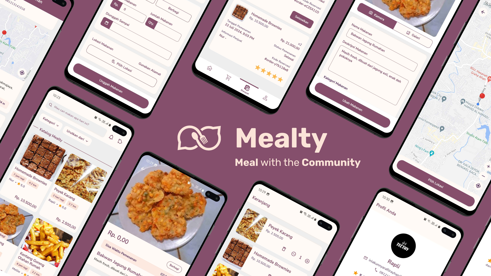

# Mealty

Mealty or <i>Meal with the Community</i> is a mobile application designed to address the critical issue of food waste in Indonesia. By connecting users with excess food to those in need, Mealty helps reduce hunger and environmental impact. Built for the Android platform using Flutter, Mealty integrates Firebase services for seamless user authentication, data storage, and media management.

## Features

- **Food Provider User**:
  - Upload photos, names, and descriptions of food.
  - Choose food categories (vegetables, side dishes, etc.).
  - Manage stock quantity and pricing.
  - Set sale options (commercial or donation).
  - Update food listings and order statuses.

- **Food Seeker User**:
  - Browse available food listings.
  - Search and filter by keywords and categories.
  - Sort results by location, time, and price.
  - View detailed information about each food item.
  - Add items to the cart and place orders.

- **All Users**:
  - Register and manage user profiles.
  - Track ongoing and download summary of completed orders.
  - Receive notifications related to food transactions.

## Technologies Used

- **Flutter**: Framework for building the mobile application.
- **Firebase**: For authentication, data storage, and media management.
- **Various Flutter Packages**: Including `google_maps_flutter`, `location`, `providers`, `go_router`, `pdf`, and more for enhanced functionality.
